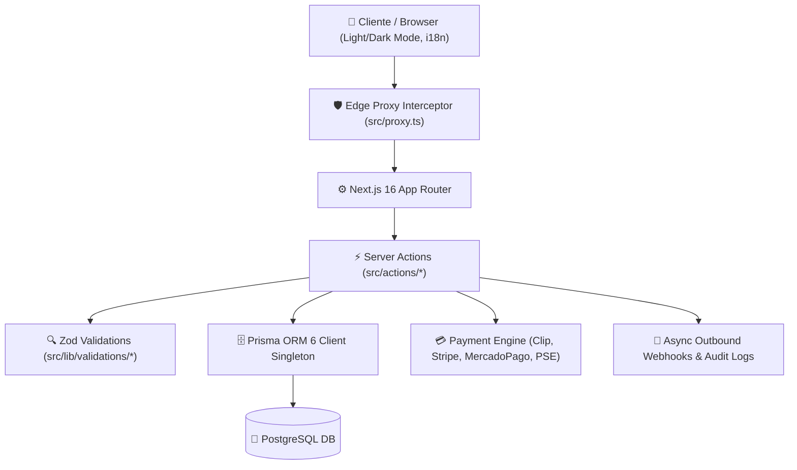
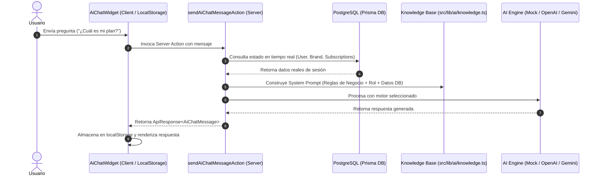

# 🚀 Next.js 16 Enterprise Boilerplate


Un **Boilerplate Enterprise de Next.js 16 (App Router)** listo para producción, diseñado con arquitectura multi-tenant (Brand management), motor de pagos multi-pasarela (Clip, Stripe, MercadoPago, PSE, Mock), autenticación RBAC avanzada, i18n nativo (Español, Inglés, Portugués), soporte completo de temas Claro/Oscuro y un entorno aislado totalmente containerizado con Docker y automatización vía `Makefile`.

---

## 📑 Tabla de Contenidos

1. [Visión General & Arquitectura](#-visión-general--arquitectura)
2. [Modelo de Datos y Objetivo de las Tablas (Prisma)](#-modelo-de-datos-y-objetivo-de-las-tablas-prisma)
3. [Stack Tecnológico](#-stack-tecnológico)
4. [Módulos Principales del Sistema](#-módulos-principales-del-sistema)
5. [Implementación del Agente de Servicio IA](#-implementación-del-agente-de-servicio-ia)
6. [Seguridad y Hardening](#-seguridad-y-hardening)
7. [Requisitos Previos](#-requisitos-previos)
8. [Variables de Entorno](#-variables-de-entorno)
9. [Comandos del Makefile (CLI)](#-comandos-del-makefile-cli)
10. [Estructura del Proyecto](#-estructura-del-proyecto)
11. [Guía de Despliegue en Producción](#-guía-de-despliegue-en-producción)

---

## 🏛️ Visión General & Arquitectura

El proyecto adopta una estructura orientada a microservicios monorepo ligera (`services/app`), separando limpiamente la capa de presentación (React Server Components & Client Components), Server Actions tipadas, capa de validación Zod y abstracción de datos con Prisma ORM 6.



---

## 🗄️ Modelo de Datos y Objetivo de las Tablas (Prisma)

A continuación se detalla la finalidad de cada tabla del esquema de PostgreSQL sin saturar de campos individuales, organizada por dominios de responsabilidad:

### 1. 🔑 Autenticación & Usuarios (Auth)

- **`User`**: Usuarios registrados de la plataforma (credenciales, rol base, marca asociada, idioma/zona horaria, PIN).
- **`Account`**: Proveedores de autenticación externa OAuth (ej. inicio de sesión con Google).
- **`Session`**: Registro de sesiones activas de usuario gestionadas por Auth.js / NextAuth.
- **`VerificationToken`**: Tokens temporales de verificación de correo electrónico.

### 2. 🛡️ Control de Acceso por Roles (RBAC)

- **`Role`**: Catálogo de roles del sistema (`SUPER_ADMIN`, `ADMIN`, `MEMBER`).
- **`Permission`**: Lista de permisos individuales de la aplicación.
- **`UserRole`**: Tabla pivote de asignación de roles a usuarios.
- **`RolePermission`**: Tabla pivote de asignación de permisos a roles.

### 3. 🔍 Seguridad & Auditoría

- **`LoginHistory`**: Historial de accesos rastreando IP, User Agent, dispositivo y navegador.
- **`RateLimit`**: Control de límites de velocidad para prevenir abuso de peticiones y fuerza bruta.

### 4. 🏢 Multi-Tenancy / Marcas

- **`Brand`**: Registro principal del inquilino (_tenant_ / marca) con moneda, zona horaria, API keys y endpoints de webhooks.

### 5. 💰 Cobros & Suscripciones SaaS (Nivel Plataforma)

- **`Subscription`**: Suscripciones de las marcas/usuarios a los planes de la plataforma SaaS.
- **`Payment`**: Registro de pagos recibidos por el SaaS por las suscripciones del sistema.
- **`PlanConfig`**: Definición de precios y características de los planes (`Free`, `Pro`, `Enterprise`) con sus _feature flags_.
- **`PaymentTransaction`**: Libro transaccional de pagos del sistema SaaS.

### 6. 💳 Cobros a Clientes de la Marca (Nivel Tenant / Negocio)

- **`BrandPaymentConfig`**: Configuración de pasarelas (Clip, Stripe, MercadoPago, PSE) y llaves privadas de cada marca.
- **`BrandCustomerPayment`**: Libro contable de cobros realizados por la marca a sus clientes finales (ej. membresías de gimnasio, servicios).

### 7. 📡 Integraciones & Auditoría de Webhooks

- **`WebhookLog`**: Registro de entregas de notificaciones salientes a n8n, CRM o servicios externos de la marca (latencia, reintentos, HTTP status).

### 8. 💱 Divisas & Tipos de Cambio

- **`ExchangeRate`**: Catálogo de monedas globales y tasas de conversión frente al USD.

---

## 🛠️ Stack Tecnológico

- **Framework Principal:** [Next.js 16.3.0](https://nextjs.org/) (App Router & React Server Components).
- **UI & Estado:** [React 19](https://react.dev/), Client Context Providers, Radix UI Primitives, Lucide Icons, Sonner Toasts.
- **Estilos & Diseño:** Tailwind CSS v4 con variables semánticas, modo oscuro avanzado (`next-themes`) y componentes adaptativos.
- **Autenticación:** [Auth.js (NextAuth v5)](https://authjs.dev/) con adaptadores Prisma, Soporte OAuth (Google), Magic Links y Credenciales con Password Hashing (`bcryptjs`).
- **Base de Datos & ORM:** [Prisma ORM 6.19](https://www.prisma.io/) + PostgreSQL 16 con migraciones e idenficadores unívocos (`cuid`).
- **Internacionalización (i18n):** Sistema multibase integrado (Español `es`, Inglés `en`, Portugués `pt`) con sincronización DB + LocalStorage + Cookies.
- **Contenerización:** Docker Compose aislado para Desarrollo y Producción con imagen optimizada en multi-etapas (_Multi-stage build_) corriendo bajo usuario no-root (`USER nextjs`) y sistema de archivos protegido (`read_only: true`).

---

## 📦 Módulos Principales del Sistema

### 1. 🔑 Autenticación & Control de Acceso Granular (RBAC)

- Registro, inicio de sesión y recuperación de sesión.
- Roles dinámicos (`Role`), Permisos (`Permission`) y vinculación `UserRole` / `RolePermission`.
- Historial de inicios de sesión (`LoginHistory`) rastreando IP, User Agent, dispositivo y navegador.
- PIN de seguridad secundario y soporte para credenciales WebAuthn / Biometría.

### 2. 🏢 Arquitectura Multi-Tenant (Brands)

- Aislamiento por marcas (`Brand`) con configuración de moneda, zona horaria y paquete de idioma por defecto.
- Claves de API (`apiKey`) por marca para integración externa.
- Webhooks dedicados para eventos de facturación y eventos generales del sistema.

### 3. 💳 Motor de Pagos Multi-Pasarela (_Payment Engine_)

- Integración unificada con múltiples proveedores financieros:
  - **Clip** (Mercado México)
  - **Stripe** (Tarjetas Internacionales)
  - **MercadoPago** (LatAm)
  - **PSE** (Pagos Seguros en Línea)
  - **Mock Provider** (Simulador local para desarrollo y pruebas)
- Almacenamiento encriptado de claves secretas por marca (`BrandPaymentConfig`).
- Historial completo de transacciones (`PaymentTransaction`) y sincronización con pasarelas externas.

### 4. 📊 Gestión de Suscripciones & Facturación SaaS

- Planes flexibles configurables (`PlanConfig`) con ciclos mensual y anual.
- Cambio de planes, cancelaciones programadas al final del periodo (`cancelAtPeriodEnd`) y planes agendados.
- Registro de pagos y facturas del sistema (`Payment`) asociadas al usuario y la marca.

### 5. 📡 Sistema Auditado de Webhooks Salientes

- Despacho asíncrono no bloqueante (`triggerOutboundWebhook()`).
- Registro de auditoría detallado (`WebhookLog`) capturando latencia (`durationMs`), código de estado HTTP, intentos y política de reintentos exponenciales.

### 6. 🌐 Internacionalización Dinámica (i18n)

- Hook personalizado `useTranslation()` con carga inteligente de diccionarios JSON.
- Claves 100% sincronizadas en `es.json`, `en.json` y `pt.json`.
- Cambio dinámico de idioma en tiempo real sin recargar la página.

### 7. 📄 Tablas de Datos Paginas en Servidor (`PaginationControl`)

- Paginación obligatoria del lado del servidor (`skip` & `take` en Prisma SQL).
- Sincronización directa de la página y filtros con los parámetros URL (`searchParams`).
- Control visible interactivo y responsivo.

### 8. 🤖 Agente de Servicio de IA & Bot Guiado (`AiChatWidget`)

- **Dos Modalidades Listas para Usar:**
  1. **Bot Guiado por Menú (Modo Estructurado - `AI_PROVIDER=mock`):** Funciona como un árbol de decisiones con rutas interactivas (`[1] Facturación`, `[2] Marcas`, `[3] Seguridad`, `[4] Soporte`) sin costo de tokens ni dependencias externas.
  2. **Agente IA Generativo (Lenguaje Natural - `AI_PROVIDER=openai|gemini|anthropic`):** Procesamiento de lenguaje natural con inyección de contexto y _guardrails_ de dominio estStrictos.
- **Monetización y Gating por Planes (SaaS Feature Gate):** Conectado con la tabla de facturación (`PlanConfig.hasAiAgent`). Los usuarios en planes **Free/Basic** reciben el **Bot Guiado por Menú** (0 costos para la plataforma), mientras que los planes **Pro/Enterprise** desbloquean el **Agente de IA Generativo** en lenguaje natural.
- **Persistencia en Cliente (0 Bloat en DB):** El historial de chat se guarda en `localStorage`, evitando consumo de almacenamiento en PostgreSQL.
- **Hydratación en Tiempo Real:** La Server Action consulta Prisma antes de responder para inyectar el estado real del usuario (nombre, plan activo, marca, vencimientos, moneda).
- **Persona por Rol (`role-aware`):** Adapta automáticamente su tono e instrucciones si responde a un Administrador de Marca o a un Usuario Final/Cliente.

---

## 🤖 Implementación del Agente de Servicio IA

El proyecto incluye un **Agente de Servicio de IA** flotante desacoplado y listo para cualquier dominio de negocio SaaS (Gimnasios, Clínicas, CRM, E-commerce, etc.).



### ⚙️ Arquitectura Desacoplada del Módulo de IA

El módulo de IA está estrictamente modularizado para separar las responsabilidades:

1. **[src/lib/ai/guided-bot.ts](file:///home/jgonzalez/code/JAGC-personal/dev/rm-menlu/services/app/src/lib/ai/guided-bot.ts):** Motor independiente para el **Bot Guiado por Rutas** (árbol de decisiones estructurado sin consumo de tokens ni APIs).
2. **[src/lib/ai/knowledge.ts](file:///home/jgonzalez/code/JAGC-personal/dev/rm-menlu/services/app/src/lib/ai/knowledge.ts):** Definición de la plantilla de conocimiento de negocio, reglas por rol y delimitación (_guardrails_).
3. **[src/lib/ai/engine.ts](file:///home/jgonzalez/code/JAGC-personal/dev/rm-menlu/services/app/src/lib/ai/engine.ts):** Resolutor principal que conecta con las APIs de IA Generativa (OpenAI, Gemini) o delega al Bot Guiado.

### ⚙️ Cómo Personalizar el Conocimiento del Negocio

Para adaptar el Agente de Servicio al dominio de tu aplicación (por ejemplo, un SaaS para Gimnasios y Artes Marciales B2B), solo debes editar el archivo `services/app/src/lib/ai/knowledge.ts`:

```typescript
export const APP_BUSINESS_KNOWLEDGE = {
  appName: "Tu SaaS de Gimnasios B2B",
  targetAudience: "Escuelas de Artes Marciales y Centros Deportivos",

  // Guía para Clientes / Estudiantes (Usuarios finales)
  userGuide: [
    "Consulta tus clases reservadas y grado de cinturón.",
    "Revisa el estado de tu membresía activa y fecha de renovación.",
  ],

  // Guía para Administradores de Marca (Dueños de gimnasios)
  adminGuide: [
    "Gestión de estudiantes, instructores y asistencia a clases.",
    "Configuración de pasarelas de cobro con Clip y Stripe para tu gimnasio.",
  ],
};
```

### 🎛️ Control por Variable de Entorno (.env)

Puedes activar o desactivar el Agente de Servicio globalmente mediante `.env`:

```env
# Activa o desactiva el widget de IA en la UI
NEXT_PUBLIC_ENABLE_AI_CHAT=true

# Proveedores disponibles: mock | openai | gemini | anthropic
AI_PROVIDER=mock
AI_API_KEY=tu_api_key_opcional
```

---

## 🛡️ Seguridad y Hardening

- **Validación en Doble Capa & Convención On Submit:** Esquemas Zod estrictamente reutilizados en formularios de cliente (`react-hook-form` + `zodResolver`) y validados en el servidor con `schema.safeParse()`.
- **Convención de Validación de Campos Únicos (On Submit):** Todos los campos unívocos que no se pueden repetir (como `email`, `slug`, `sku`) se validan en el servidor **únicamente al presionar el botón de envío (Submit)**. Si un valor ya existe en la base de datos:
  - NUNCA se borra el contenido ingresado en el input para no causar frustración al usuario.
  - El input se destaca con estilo de error en borde rojo (`border-rose-500 ring-2 ring-rose-500/20`).
  - Se muestra un mensaje explícito directamente debajo del campo.
  - Se notifica mediante una alerta Toast.
- **Protección en Docker (Producción):**
  - Ejecución como usuario restringido sin privilegios (`USER nextjs` UID 1001).
  - Sistema de archivos en solo lectura (`read_only: true`).
  - Montaje de carpetas de caché y temporales en memoria RAM (`tmpfs: [/tmp, /app/.next/cache]`).
  - Prevención de escalación de privilegios (`no-new-privileges:true`).

---

## ⚙️ Requisitos Previos

- **Docker Engine** `>= 24.0` y **Docker Compose** `>= 2.20`
- **GNU Make** en la máquina anfitriona
- _(Opcional)_ **Node.js** `>= 22.0` (todos los comandos NPM y Prisma se ejecutan dentro del contenedor a través de `make`).

---

## 🔐 Variables de Entorno

Crea un archivo `.env` en la raíz del proyecto basándote en `.env.sample`:

```bash
cp .env.sample .env
```

### Principales variables requeridas:

```env
# Entorno
NODE_ENV=development
DOCKER_NETWORK_NAME=dev-network
PORT=3000

# Base de Datos PostgreSQL
DATABASE_URL="postgresql://postgres:postgres@db:5432/nextjs_db?schema=public"

# Auth.js / NextAuth
NEXTAUTH_SECRET="tu_secreto_super_seguro_aqui"
NEXTAUTH_URL="http://localhost:3000"
AUTH_SECRET="tu_secreto_super_seguro_aqui"
AUTH_URL="http://localhost:3000"

# Pasarelas de Pago (Opcionales en Dev / Mock activo por defecto)
CLIP_PUBLIC_KEY=""
CLIP_SECRET_KEY=""
STRIPE_PUBLIC_KEY=""
STRIPE_SECRET_KEY=""
MERCADOPAGO_ACCESS_TOKEN=""
```

---

## 💻 Comandos del Makefile (CLI)

Todos los procesos de compilación, migración y ejecución están aislados en Docker mediante el `Makefile`:

| Comando             | Descripción                                                                  |
| :------------------ | :--------------------------------------------------------------------------- |
| `make dev-up`       | Inicia el entorno de desarrollo con Hot-Reload (primer plano).               |
| `make dev-up-d`     | Inicia el entorno de desarrollo en segundo plano (detached).                 |
| `make dev-up-build` | Fuerza la reconstrucción del contenedor e inicia desarrollo.                 |
| `make dev-down`     | Detiene los contenedores de desarrollo.                                      |
| `make db-setup`     | Inicialización completa de la base de datos (Generate + Migrate + Seed).     |
| `make db-migrate`   | Ejecuta las migraciones pendientes de Prisma dev.                            |
| `make db-seed`      | Sembrado de datos idempotente (`prisma/seed.ts`).                            |
| `make db-studio`    | Abre la interfaz visual de Prisma Studio.                                    |
| `make check`        | Valida TypeScript (`tsc --noEmit`) y reglas de ESLint dentro del contenedor. |
| `make lint-fix`     | Corrige automáticamente errores de linter y formato dentro del contenedor.   |
| `make shell-app`    | Abre una terminal interactiva `sh` dentro del contenedor de la aplicación.   |
| `make logs`         | Muestra los logs en tiempo real de la aplicación.                            |
| `make clean`        | Limpieza profunda: Elimina contenedores, volúmenes y la caché `.next`.       |

---

## 📁 Estructura del Proyecto

```text
.
├── .prod_environment/         # Configuración y Makefile de despliegue remoto
│   ├── docker-compose.prod.yml# Docker Compose con reglas de hardening
│   └── Makefile               # Scripts de despliegue en servidor VPS
├── services/
│   └── app/
│       ├── prisma/
│       │   ├── schema.prisma  # Modelos de datos PostgreSQL
│       │   └── seed.ts        # Semillero idempotente
│       ├── src/
│       │   ├── actions/       # Server Actions tipadas por dominio
│       │   ├── app/           # Rutas del Next.js App Router
│       │   ├── components/    # Componentes UI (Radix, UI, Layouts, Dashboard)
│       │   ├── context/       # Proveedores de estado (i18n, Theme, Auth)
│       │   ├── lib/           # Validaciones Zod, utilidades y Prisma singleton
│       │   ├── locales/       # Diccionarios de idioma (es.json, en.json, pt.json)
│       │   └── proxy.ts       # Edge proxy router y seguridad
│       ├── Dockerfile         # Build multi-etapa optimizado
│       └── package.json       # Dependencias del proyecto
├── docker-compose.yml         # Base Docker Compose
├── docker-compose.dev.yml     # Override para desarrollo local
├── Makefile                   # CLI principal de comandos Docker
└── README.md                  # Documentación del proyecto
```

---

## 🚀 Guía de Despliegue en Producción

El proyecto incluye un flujo optimizado de despliegue mediante compilación local e inyección por SCP hacia el servidor remoto:

1. **Validación Previa Local:**

   ```bash
   make check
   ```

2. **Compilación de Imagen de Producción & Empaquetado:**

   ```bash
   make prod-build
   make prod-save
   ```

3. **Transferencia y Despliegue en VPS (Vía SCP/SSH):**

   ```bash
   make prod-scp
   make prod-deploy
   ```

4. **Sincronización de Base de Datos en Producción:**
   En el servidor remoto, ejecuta:
   ```bash
   make db-setup-prod
   ```

---

<p align="center">
  Desarrollado con ❤️ para aplicaciones web modernas, escalables y seguras.
</p>
